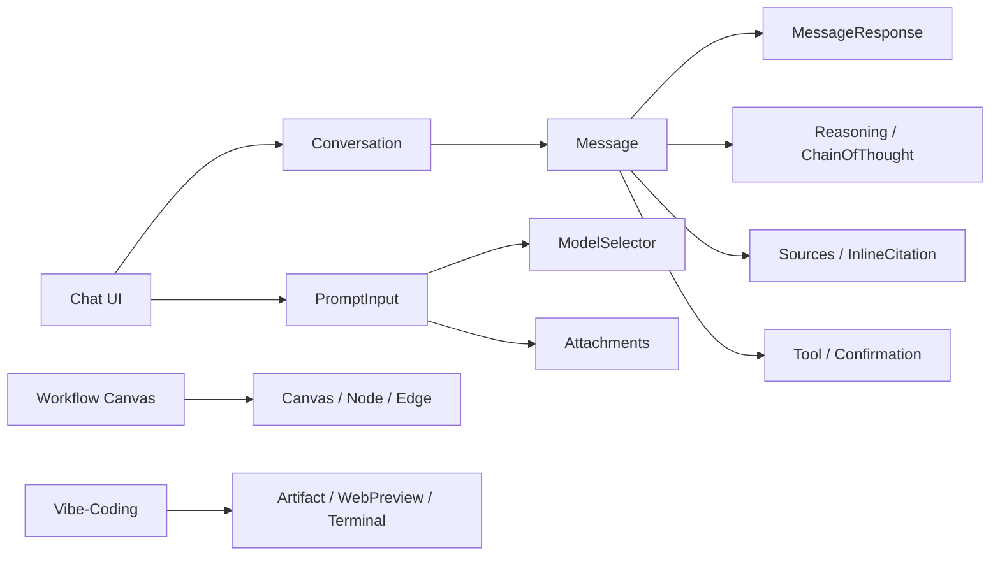

# AI Elements Vue — Cookbook

A practical, recipe-style guide for building AI-native Vue applications with
[**AI Elements Vue**](https://github.com/vuepont/ai-elements-vue) (`ai-element`).
Every recipe is a self-contained **Problem → Solution → Code → Notes** entry that
you can copy straight into your Vue.js / Nuxt.js project.

> **What is AI Elements Vue?**
> A shadcn-vue–based component library for AI applications. It ships pre-built,
> fully customizable components for conversations, messages, code blocks,
> reasoning displays, tool usage, prompt inputs, workflow canvases, and more.
> The CLI copies component _source code_ into your project, so everything is
> yours to edit.

**Docs site:** This cookbook is also published as a VitePress site. Run
`npm run docs:dev` to browse it locally, `npm run docs:build` to build the
static site, or `npm run docs:preview` to preview a production build.

---

## How to use this cookbook

The recipes are ordered from **basic → advanced**. Work through them in order, or
jump to whatever you need:

| Level            | File                                                                         | Covers                                                   |
| ---------------- | ---------------------------------------------------------------------------- | -------------------------------------------------------- |
| **Basic**        | [01 Getting Started](./01-getting-started.md)                                | Install, prerequisites, add your first component         |
| **Basic**        | [02 Message & Conversation](./02-message-and-conversation.md)                | `Message`, `Conversation`, branches, actions, streaming  |
| **Basic**        | [03 Prompt Input](./03-prompt-input.md)                                      | `PromptInput`, `ModelSelector`, attachments, submit flow |
| **Intermediate** | [04 Reasoning & Thinking](./04-reasoning-and-thinking.md)                    | `Reasoning`, `ChainOfThought`, `Shimmer`                 |
| **Intermediate** | [05 Tools, Confirmation & Context](./05-tools-confirmation-context.md)       | `Tool`, `Confirmation`, `Context`, `CodeBlock`           |
| **Intermediate** | [06 Queue, Task & Plan](./06-queue-task-plan.md)                             | `Queue`, `Task`, `Plan`                                  |
| **Intermediate** | [07 Sources, Citations & Attachments](./07-sources-citations-attachments.md) | `Sources`, `InlineCitation`, `Attachments`, `Suggestion` |
| **Advanced**     | [08 Artifacts, Terminal & FileTree](./08-artifacts-terminal-filetree.md)     | `Artifact`, `Terminal`, `FileTree`, `Loader`             |
| **Advanced**     | [09 Full Chat Application](./09-full-chat-application.md)                    | Complete working chat UI (the "chatbot" recipe)          |
| **Advanced**     | [10 Workflow Canvas](./10-workflow-canvas.md)                                | `Canvas`, `Node`, `Edge`, `Controls`, `Panel`, `Toolbar` |
| **Advanced**     | [11 Voice, Media & Theming](./11-voice-media-theming.md)                     | Audio/speech components, `Image`, `WebPreview`, theming  |
| **Reference**    | [Glossary](./glossary.md)                                                    | Every component & AI SDK term used in the cookbook       |

---

## Quick reference — what you can build

## Prerequisites (summary)

- Node.js 18 or later
- A Vue.js or Nuxt.js project with the **AI SDK** (`ai`) installed
- **shadcn-vue** initialized (`npx shadcn-vue@latest init`)
- **Tailwind CSS** configured in **CSS Variables** mode

See [01 Getting Started](./01-getting-started.md) for the full setup walkthrough.

---

## Component categories at a glance

| Category          | Components                                                                                                                                                                                                                    |
| ----------------- | ----------------------------------------------------------------------------------------------------------------------------------------------------------------------------------------------------------------------------- |
| **Chatbot**       | `chain-of-thought`, `checkpoint`, `confirmation`, `context`, `conversation`, `inline-citation`, `message`, `model-selector`, `plan`, `prompt-input`, `queue`, `reasoning`, `shimmer`, `sources`, `suggestion`, `task`, `tool` |
| **Workflow**      | `canvas`, `connection`, `controls`, `edge`, `node`, `panel`, `toolbar`                                                                                                                                                        |
| **Vibe-Coding**   | `artifact`, `web-preview`                                                                                                                                                                                                     |
| **Documentation** | `open-in-chat`                                                                                                                                                                                                                |
| **Utilities**     | `code-block`, `image`, `loader`                                                                                                                                                                                               |

> **Note on imports:** because the CLI installs component _source_ into your
> `components` directory, imports look like
> `@/components/ai-elements/message` (adjust the alias if your
> `components.json` uses a different path).
